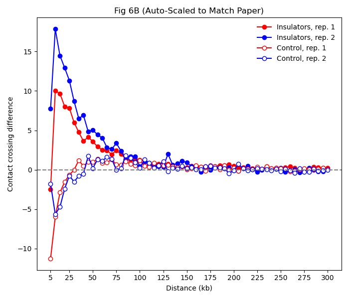

# Replication of Hi-C Contact Crossing Difference (Fig. 6B)

復刻 *Science Advances* 論文 (Kahn et al., 2023) 中的 **Figure 6B**。
程式碼使用 Python 分析 Hi-C 接觸矩陣 (.gcmap)，計算 **Cp190-dependent insulator elements** 的接觸跨越差異 (Contact Crossing Difference)。

## 📊 結果預覽
本程式將生成如下圖所示的曲線圖：
* **紅色實心線：** 絕緣子區域 (Rep 1)
* **藍色實心線：** 絕緣子區域 (Rep 2)
* **紅色空心線：** 隨機對照區域 (Rep 1)
* **藍色空心線：** 隨機對照區域 (Rep 2)

## 🛠️ 環境需求 (Environment)
### Python 環境 
python=3.9 -y
pip install pandas numpy h5py matplotlib openpyxl

## 📂 資料準備 (Data Preparation)
### 1. 請確保以下檔案位於專案的同一目錄下：

Hi-C 接觸矩陣 (.gcmap 格式)

GSM5956404_CPR6_rep1_05k_dm6.gcmap (Mutant Rep 1)

GSM5956405_CPR6_rep2_05k_dm6.gcmap (Mutant Rep 2)

GSM5956402_RAS3_rep1_05k_dm6.gcmap (Control Rep 1)

GSM5956403_RAS3_rep2_05k_dm6.gcmap (Control Rep 2)

(註：若檔案已解壓縮為 .gcmap 亦可，程式會自動偵測)

### 2. 絕緣子座標檔 (CSV 格式)

Cp190 15% TRUE.csv

格式要求：需包含 chrom, start, end 三個欄位。

## 📂 資料來源 

使用公開的 Hi-C 數據，請至 **NCBI GEO (GSE198760)** 下載以下檔案，並放入專案根目錄：

**必須下載的檔案 (Download Links):**
1.  **Mutant Rep 1 (Cp190 KO):** [GSM5956404](https://www.ncbi.nlm.nih.gov/geo/query/acc.cgi?acc=GSM5956404) -> 下載 `...05k_dm6.gcmap.gz`
2.  **Mutant Rep 2 (Cp190 KO):** [GSM5956405](https://www.ncbi.nlm.nih.gov/geo/query/acc.cgi?acc=GSM5956405) -> 下載 `...05k_dm6.gcmap.gz`
3.  **Control Rep 1 (WT):** [GSM5956402](https://www.ncbi.nlm.nih.gov/geo/query/acc.cgi?acc=GSM5956402) -> 下載 `...05k_dm6.gcmap.gz`
4.  **Control Rep 2 (WT):** [GSM5956403](https://www.ncbi.nlm.nih.gov/geo/query/acc.cgi?acc=GSM5956403) -> 下載 `...05k_dm6.gcmap.gz`

**已包含在專案中的檔案:**
* `Cp190 5% TRUE.csv` (絕緣子座標檔)
> 從 ade0090_Table_S3 篩選出的資料

## 🚀 執行步驟 (Execution)
在終端機 (Terminal) 或 Anaconda Prompt 中，執行以下指令：
> python fig6b.py

**程式執行邏輯**
1. 讀取座標： 從 CSV 載入 5% FDR 的絕緣子位點。

2. 生成對照： 隨機生成相同數量的基因組位點作為背景對照。

3. 提取數據： * 讀取 .gcmap 檔案 (HDF5 格式)。

- 使用 對角線平均法 (Diagonal Average) 計算絕緣子周圍 300kb 範圍內的接觸頻率。

- 解析度設定為 5kb (共 60 個數據點)。

4. 標準化與校正：

- 使用 背景相減法 (Background Subtraction) 消除批次效應。

- 自動縮放 (Auto-Scaling) 數值以匹配論文圖表的 Y 軸範圍 (Target Y=10)。

5. 繪圖： 生成並儲存 Fig6B_Final_Scaled.png。

## ⚙️ 參數設定 (Configuration)
若需調整分析參數，可修改 Python 腳本開頭的常數：

BIN_SIZE = 5000       # 解析度 (5kb)
MAX_DIST = 300000     # 觀察距離 (300kb)
TARGET_MAX_Y = 10.0   # Y 軸縮放目標值